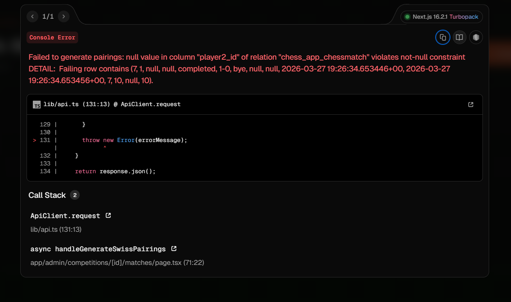

# Design Document: Chess Platform Enhancements

## Overview

This design document specifies the technical implementation for eight  features to the existing Django chess competition platform. The enhancements add comprehensive participant and match management capabilities, advanced tournament pairing algorithms, audit logging, bracket visualization, and a full authentication system.

The platform currently uses Django 4.2.11 with Django REST Framework 3.14.0, SQLite database, and integrates with Lichess for game tracking. These enhancements maintain compatibility with the existing architecture while adding significant new functionality for both administrators and participants.

### Feature Summary

1. **Participant List Page**: Admin view of all participants across competitions with filtering
2. **Match History Per Participant**: Detailed match history and statistics for individual participants
3. **Simple My Matches Page**: Public page for participants to view their matches by username
4. **Swiss-Style Round Pairing**: Automated pairing algorithm for Swiss-system tournaments
5. **Audit Log for Admin Overrides**: Tracking and display of all administrative actions
6. **Match List Page**: Admin view of all matches across competitions with filtering
7. **Knockout Bracket Visualization**: Visual tree display of single-elimination tournaments
8. **Full Authentication System**: User accounts with registration, login, and participant linking

### Design Goals

- Maintain compatibility with existing models and Lichess integration
- Follow Django best practices and existing code patterns
- Preserve the dark theme with orange accent (#ff6b35)
- Ensure performance for up to 1000 participants and 5000 matches
- Provide intuitive navigation between all features
- Implement comprehensive security for admin and authenticated pages

## Architecture

### System Architecture

The platform follows Django's MVT (Model-View-Template) architecture with REST API endpoints for dynamic functionality:

```
┌─────────────────────────────────────────────────────────────┐
│                        Presentation Layer                    │
│  ┌──────────────┐  ┌──────────────┐  ┌──────────────┐      │
│  │   Templates  │  │  Static CSS  │  │  JavaScript  │      │
│  │   (HTML)     │  │   (Styles)   │  │   (HTMX)     │      │
│  └──────────────┘  └──────────────┘  └──────────────┘      │
└─────────────────────────────────────────────────────────────┘
                            │
                            ▼
┌─────────────────────────────────────────────────────────────┐
│                      Application Layer                       │
│  ┌──────────────┐  ┌──────────────┐  ┌──────────────┐      │
│  │    Views     │  │  API Views   │  │    Forms     │      │
│  │  (Django)    │  │    (DRF)     │  │ (Validation) │      │
│  └──────────────┘  └──────────────┘  └──────────────┘      │
│  ┌──────────────┐  ┌──────────────┐  ┌──────────────┐      │
│  │   Pairing    │  │    Auth      │  │    Audit     │      │
│  │   Logic      │  │  Middleware  │  │   Logger     │      │
│  └──────────────┘  └──────────────┘  └──────────────┘      │
└─────────────────────────────────────────────────────────────┘
                            │
                            ▼
┌─────────────────────────────────────────────────────────────┐
│                         Data Layer                           │
│  ┌──────────────┐  ┌──────────────┐  ┌──────────────┐      │
│  │    Models    │  │   Managers   │  │  Validators  │      │
│  │   (Django    │  │   (Query     │  │   (Business  │      │
│  │     ORM)     │  │   Logic)     │  │    Rules)    │      │
│  └──────────────┘  └──────────────┘  └──────────────┘      │
└─────────────────────────────────────────────────────────────┘
                            │
                            ▼
┌─────────────────────────────────────────────────────────────┐
│                      Database (SQLite)                       │
│  ChessCompetition │ ChessParticipant │ ChessMatch │         │
│  AuditLog │ UserProfile │ ChessResultSyncLog                │
└─────────────────────────────────────────────────────────────┘
```

### Component Interactions

```
User Request
    │
    ├─→ Public Pages (My Matches)
    │       └─→ No authentication required
    │
    ├─→ Authenticated Pages (Dashboard)
    │       └─→ Login required
    │
    └─→ Admin Pages (Participant List, Match List, Audit Log)
            └─→ Admin permission required
                    │
                    ├─→ CRUD Operations
                    │       └─→ Audit Log Entry Created
                    │
                    ├─→ Swiss Pairing
                    │       └─→ Match Records Created
                    │
                    └─→ Bracket Visualization
                            └─→ Read-only Display
```

### URL Structure

```
/                                    # Home/Competition List
/competitions/                       # Competition List
/competitions/<slug>/                # Competition Detail
/competitions/<slug>/leaderboard/    # Leaderboard

# New Feature URLs
/participants/                       # Participant List (Admin)
/participants/<id>/history/          # Match History (Admin)
/my-matches/                         # My Matches (Public)
/matches/                            # Match List (Admin)
/competitions/<slug>/bracket/        # Knockout Bracket
/competitions/<slug>/swiss-pair/     # Swiss Pairing (Admin)
/audit-log/                          # Audit Log (Admin)

# Authentication URLs
/accounts/register/                  # User Registration
/accounts/login/                     # User Login
/accounts/logout/                    # User Logout
/accounts/profile/                   # User Profile
/accounts/link-participant/          # Link Lichess Username
/accounts/password-reset/            # Password Reset
/dashboard/                          # User Dashboard
```

## Components and Interfaces

### New Models

#### AuditLog Model

Tracks all administrative actions for accountability and investigation.

```python
class AuditLog(models.Model):
    """Audit log for administrative actions"""
    ACTION_CHOICES = [
        ('create_match', 'Create Match'),
        ('update_match', 'Update Match'),
        ('delete_match', 'Delete Match'),
        ('create_participant', 'Create Participant'),
        ('update_participant', 'Update Participant'),
        ('delete_participant', 'Delete Participant'),
        ('swiss_pairing', 'Swiss Pairing'),
    ]
    
    admin_user = models.ForeignKey(
        'auth.User',
        on_delete=models.SET_NULL,
        null=True,
        related_name='audit_logs'
    )
    action_type = models.CharField(max_length=50, choices=ACTION_CHOICES)
    timestamp = models.DateTimeField(auto_now_add=True)
    match = models.ForeignKey(
        'ChessMatch',
        on_delete=models.SET_NULL,
        null=True,
        blank=True,
        related_name='audit_logs'
    )
    participant = models.ForeignKey(
        'ChessParticipant',
        on_delete=models.SET_NULL,
        null=True,
        blank=True,
        related_name='audit_logs'
    )
    previous_values = models.JSONField(null=True, blank=True)
    new_values = models.JSONField(null=True, blank=True)
    ip_address = models.GenericIPAddressField(null=True, blank=True)
    user_agent = models.TextField(blank=True)
    
    class Meta:
        ordering = ['-timestamp']
        indexes = [
            models.Index(fields=['-timestamp']),
            models.Index(fields=['admin_user', '-timestamp']),
            models.Index(fields=['action_type', '-timestamp']),
        ]
    
    def __str__(self):
        return f"{self.admin_user} - {self.action_type} at {self.timestamp}"
```

#### UserProfile Model

Extends Django's User model to link with Lichess participants.

```python
class UserProfile(models.Model):
    """User profile linking to Lichess participants"""
    user = models.OneToOneField(
        'auth.User',
        on_delete=models.CASCADE,
        related_name='profile'
    )
    linked_participants = models.ManyToManyField(
        'ChessParticipant',
        related_name='user_profiles',
        blank=True
    )
    created_at = models.DateTimeField(auto_now_add=True)
    updated_at = models.DateTimeField(auto_now=True)
    
    def __str__(self):
        return f"Profile for {self.user.username}"
    
    def get_all_matches(self):
        """Get all matches for linked participants"""
        from django.db.models import Q
        matches = ChessMatch.objects.none()
        for participant in self.linked_participants.all():
            participant_matches = ChessMatch.objects.filter(
                Q(player1=participant) | Q(player2=participant)
            )
            matches = matches | participant_matches
        return matches.distinct().order_by('-created_at')
```

#### Model Extensions

Add fields to existing ChessCompetition model:

```python
# Add to ChessCompetition model
tournament_type = models.CharField(
    max_length=20,
    choices=[
        ('swiss', 'Swiss System'),
        ('knockout', 'Knockout'),
        ('round_robin', 'Round Robin'),
    ],
    default='swiss'
)
```

### Views

#### Participant Management Views

```python
# views.py

@login_required
@user_passes_test(lambda u: u.is_staff)
def participant_list(request):
    """List all participants with filtering"""
    participants = ChessParticipant.objects.select_related('competition').all()
    
    # Filtering
    competition_filter = request.GET.get('competition')
    username_filter = request.GET.get('username')
    
    if competition_filter:
        participants = participants.filter(competition_id=competition_filter)
    
    if username_filter:
        participants = participants.filter(
            lichess_username__icontains=username_filter
        )
    
    # Annotate with match count
    from django.db.models import Count, Q
    participants = participants.annotate(
        match_count=Count('matches_as_player1') + Count('matches_as_player2')
    )
    
    participants = participants.order_by('-registered_at')
    
    context = {
        'participants': participants,
        'total_count': participants.count(),
        'competitions': ChessCompetition.objects.all(),
        'filters': {
            'competition': competition_filter,
            'username': username_filter,
        }
    }
    
    return render(request, 'chess_app/participant_list.html', context)


@login_required
@user_passes_test(lambda u: u.is_staff)
def participant_history(request, participant_id):
    """Match history for a specific participant"""
    participant = get_object_or_404(ChessParticipant, pk=participant_id)
    
    # Get all matches
    from django.db.models import Q
    matches = ChessMatch.objects.filter(
        Q(player1=participant) | Q(player2=participant)
    ).select_related('player1', 'player2', 'competition').order_by('-created_at')
    
    # Calculate statistics
    wins = 0
    losses = 0
    draws = 0
    
    for match in matches:
        if match.status != 'completed':
            continue
            
        if match.player1 == participant:
            if match.result == '1-0':
                wins += 1
            elif match.result == '0-1':
                losses += 1
            elif match.result == '1/2-1/2':
                draws += 1
        else:  # player2
            if match.result == '0-1':
                wins += 1
            elif match.result == '1-0':
                losses += 1
            elif match.result == '1/2-1/2':
                draws += 1
    
    total_matches = wins + losses + draws
    win_percentage = (wins / total_matches * 100) if total_matches > 0 else 0
    
    context = {
        'participant': participant,
        'matches': matches,
        'stats': {
            'wins': wins,
            'losses': losses,
            'draws': draws,
            'total': total_matches,
            'win_percentage': round(win_percentage, 1),
        }
    }
    
    return render(request, 'chess_app/participant_history.html', context)
```

#### My Matches View (Public)

```python
def my_matches(request):
    """Public page for viewing matches by Lichess username"""
    lichess_username = request.GET.get('username', '').strip()
    matches_by_competition = {}
    stats = None
    participant_found = False
    
    if lichess_username:
        # Find all participants with this username
        participants = ChessParticipant.objects.filter(
            lichess_username__iexact=lichess_username
        ).select_related('competition')
        
        if participants.exists():
            participant_found = True
            
            # Get matches grouped by competition
            from django.db.models import Q
            for participant in participants:
                matches = ChessMatch.objects.filter(
                    Q(player1=participant) | Q(player2=participant)
                ).select_related('player1', 'player2', 'competition').order_by('-created_at')
                
                if matches.exists():
                    matches_by_competition[participant.competition] = {
                        'participant': participant,
                        'matches': matches
                    }
            
            # Calculate overall statistics
            all_matches = ChessMatch.objects.filter(
                Q(player1__in=participants) | Q(player2__in=participants),
                status='completed'
            )
            
            wins = 0
            losses = 0
            draws = 0
            
            for match in all_matches:
                participant = participants.filter(
                    Q(pk=match.player1_id) | Q(pk=match.player2_id)
                ).first()
                
                if match.player1 == participant:
                    if match.result == '1-0':
                        wins += 1
                    elif match.result == '0-1':
                        losses += 1
                    elif match.result == '1/2-1/2':
                        draws += 1
                else:
                    if match.result == '0-1':
                        wins += 1
                    elif match.result == '1-0':
                        losses += 1
                    elif match.result == '1/2-1/2':
                        draws += 1
            
            total = wins + losses + draws
            win_percentage = (wins / total * 100) if total > 0 else 0
            
            stats = {
                'wins': wins,
                'losses': losses,
                'draws': draws,
                'total': total,
                'win_percentage': round(win_percentage, 1),
            }
    
    context = {
        'lichess_username': lichess_username,
        'matches_by_competition': matches_by_competition,
        'stats': stats,
        'participant_found': participant_found,
    }
    
    return render(request, 'chess_app/my_matches.html', context)
```


#### Match List View

```python
@login_required
@user_passes_test(lambda u: u.is_staff)
def match_list(request):
    """List all matches with filtering"""
    matches = ChessMatch.objects.select_related(
        'competition', 'player1', 'player2'
    ).all()
    
    # Filtering
    competition_filter = request.GET.get('competition')
    participant_filter = request.GET.get('participant')
    result_filter = request.GET.get('result')
    date_from = request.GET.get('date_from')
    date_to = request.GET.get('date_to')
    
    if competition_filter:
        matches = matches.filter(competition_id=competition_filter)
    
    if participant_filter:
        from django.db.models import Q
        matches = matches.filter(
            Q(player1__lichess_username__icontains=participant_filter) |
            Q(player2__lichess_username__icontains=participant_filter)
        )
    
    if result_filter:
        matches = matches.filter(result=result_filter)
    
    if date_from:
        matches = matches.filter(created_at__gte=date_from)
    
    if date_to:
        matches = matches.filter(created_at__lte=date_to)
    
    matches = matches.order_by('-created_at')
    
    context = {
        'matches': matches,
        'total_count': matches.count(),
        'competitions': ChessCompetition.objects.all(),
        'result_choices': ChessMatch.RESULT_CHOICES,
        'filters': {
            'competition': competition_filter,
            'participant': participant_filter,
            'result': result_filter,
            'date_from': date_from,
            'date_to': date_to,
        }
    }
    
    return render(request, 'chess_app/match_list.html', context)
```

#### Swiss Pairing View

```python
@login_required
@user_passes_test(lambda u: u.is_staff)
def swiss_pairing(request, slug):
    """Generate Swiss-style pairings for next round"""
    competition = get_object_or_404(ChessCompetition, slug=slug)
    
    if request.method == 'POST':
        try:
            pairings = generate_swiss_pairings(competition)
            
            # Create matches
            round_number = ChessMatch.objects.filter(
                competition=competition
            ).aggregate(models.Max('round_number'))['round_number__max'] or 0
            round_number += 1
            
            for pairing in pairings:
                match = ChessMatch.objects.create(
                    competition=competition,
                    player1=pairing['player1'],
                    player2=pairing['player2'],
                    round_number=round_number,
                    status='pending'
                )
                
                # Log audit entry
                AuditLog.objects.create(
                    admin_user=request.user,
                    action_type='swiss_pairing',
                    match=match,
                    new_values={
                        'round_number': round_number,
                        'player1': pairing['player1'].lichess_username,
                        'player2': pairing['player2'].lichess_username,
                    }
                )
            
            messages.success(
                request,
                f'Created {len(pairings)} pairings for round {round_number}'
            )
            return redirect('competition_detail', slug=slug)
            
        except ValueError as e:
            messages.error(request, str(e))
    
    # Preview pairings
    try:
        pairings = generate_swiss_pairings(competition)
        context = {
            'competition': competition,
            'pairings': pairings,
        }
        return render(request, 'chess_app/swiss_pairing.html', context)
    except ValueError as e:
        messages.error(request, str(e))
        return redirect('competition_detail', slug=slug)


def generate_swiss_pairings(competition):
    """Generate Swiss-style pairings"""
    participants = list(competition.participants.all())
    
    if len(participants) < 2:
        raise ValueError("Need at least 2 participants for pairing")
    
    # Calculate scores for each participant
    participant_scores = []
    for participant in participants:
        score = calculate_participant_score(participant, competition)
        participant_scores.append({
            'participant': participant,
            'score': score
        })
    
    # Sort by score descending
    participant_scores.sort(key=lambda x: -x['score'])
    
    # Get existing pairings to avoid rematches
    existing_pairings = set()
    matches = ChessMatch.objects.filter(competition=competition)
    for match in matches:
        pair = tuple(sorted([match.player1_id, match.player2_id]))
        existing_pairings.add(pair)
    
    # Generate pairings
    pairings = []
    paired = set()
    
    for i, entry in enumerate(participant_scores):
        if entry['participant'].id in paired:
            continue
        
        # Try to pair with next available participant
        for j in range(i + 1, len(participant_scores)):
            candidate = participant_scores[j]['participant']
            
            if candidate.id in paired:
                continue
            
            # Check if they've played before
            pair = tuple(sorted([entry['participant'].id, candidate.id]))
            if pair not in existing_pairings:
                pairings.append({
                    'player1': entry['participant'],
                    'player2': candidate,
                    'score1': entry['score'],
                    'score2': participant_scores[j]['score'],
                })
                paired.add(entry['participant'].id)
                paired.add(candidate.id)
                break
    
    # Handle bye if odd number
    if len(paired) < len(participants):
        unpaired = [p for p in participants if p.id not in paired]
        if len(unpaired) == 1:
            # Assign bye (represented as match with player2=None)
            pairings.append({
                'player1': unpaired[0],
                'player2': None,  # Bye
                'score1': calculate_participant_score(unpaired[0], competition),
                'score2': None,
            })
    
    if not pairings:
        raise ValueError("Could not generate valid pairings")
    
    return pairings


def calculate_participant_score(participant, competition):
    """Calculate Swiss score for a participant"""
    from django.db.models import Q
    
    matches = ChessMatch.objects.filter(
        Q(player1=participant) | Q(player2=participant),
        competition=competition,
        status='completed'
    )
    
    score = 0.0
    for match in matches:
        if match.player1 == participant:
            if match.result == '1-0':
                score += 1.0
            elif match.result == '1/2-1/2':
                score += 0.5
        else:  # player2
            if match.result == '0-1':
                score += 1.0
            elif match.result == '1/2-1/2':
                score += 0.5
    
    return score
```

#### Audit Log View

```python
@login_required
@user_passes_test(lambda u: u.is_staff)
def audit_log_list(request):
    """Display audit log with filtering"""
    logs = AuditLog.objects.select_related(
        'admin_user', 'match', 'participant'
    ).all()
    
    # Filtering
    admin_filter = request.GET.get('admin')
    action_filter = request.GET.get('action')
    date_from = request.GET.get('date_from')
    date_to = request.GET.get('date_to')
    
    if admin_filter:
        logs = logs.filter(admin_user__username__icontains=admin_filter)
    
    if action_filter:
        logs = logs.filter(action_type=action_filter)
    
    if date_from:
        logs = logs.filter(timestamp__gte=date_from)
    
    if date_to:
        logs = logs.filter(timestamp__lte=date_to)
    
    logs = logs.order_by('-timestamp')
    
    context = {
        'logs': logs,
        'total_count': logs.count(),
        'action_choices': AuditLog.ACTION_CHOICES,
        'filters': {
            'admin': admin_filter,
            'action': action_filter,
            'date_from': date_from,
            'date_to': date_to,
        }
    }
    
    return render(request, 'chess_app/audit_log.html', context)
```

#### Knockout Bracket View

```python
def knockout_bracket(request, slug):
    """Display knockout bracket visualization"""
    competition = get_object_or_404(ChessCompetition, slug=slug)
    
    if competition.tournament_type != 'knockout':
        messages.warning(request, 'This competition is not a knockout tournament')
        return redirect('competition_detail', slug=slug)
    
    # Build bracket structure
    bracket = build_bracket_structure(competition)
    
    context = {
        'competition': competition,
        'bracket': bracket,
    }
    
    return render(request, 'chess_app/knockout_bracket.html', context)


def build_bracket_structure(competition):
    """Build bracket structure from matches"""
    import math
    
    participants = list(competition.participants.all())
    participant_count = len(participants)
    
    # Determine bracket size (next power of 2)
    bracket_size = 2 ** math.ceil(math.log2(max(participant_count, 2)))
    
    # Get all matches ordered by round
    matches = ChessMatch.objects.filter(
        competition=competition
    ).select_related('player1', 'player2', 'winner').order_by('round_number', 'id')
    
    # Organize matches by round
    rounds = {}
    max_round = matches.aggregate(models.Max('round_number'))['round_number__max'] or 0
    
    for match in matches:
        round_num = match.round_number
        if round_num not in rounds:
            rounds[round_num] = []
        rounds[round_num].append(match)
    
    # Calculate round labels
    num_rounds = math.ceil(math.log2(bracket_size))
    round_labels = []
    for i in range(1, num_rounds + 1):
        if i == num_rounds:
            round_labels.append('Finals')
        elif i == num_rounds - 1:
            round_labels.append('Semifinals')
        elif i == num_rounds - 2:
            round_labels.append('Quarterfinals')
        else:
            round_labels.append(f'Round {i}')
    
    bracket = {
        'size': bracket_size,
        'rounds': rounds,
        'round_labels': round_labels,
        'num_rounds': num_rounds,
    }
    
    return bracket
```

#### Authentication Views

```python
from django.contrib.auth import login, authenticate, logout
from django.contrib.auth.forms import UserCreationForm, AuthenticationForm
from django.contrib.auth.models import User


def register(request):
    """User registration"""
    if request.method == 'POST':
        form = UserCreationForm(request.POST)
        if form.is_valid():
            user = form.save()
            
            # Create user profile
            UserProfile.objects.create(user=user)
            
            # Log in the user
            login(request, user)
            messages.success(request, 'Registration successful!')
            return redirect('dashboard')
    else:
        form = UserCreationForm()
    
    return render(request, 'chess_app/register.html', {'form': form})


def user_login(request):
    """User login"""
    if request.method == 'POST':
        form = AuthenticationForm(request, data=request.POST)
        if form.is_valid():
            username = form.cleaned_data.get('username')
            password = form.cleaned_data.get('password')
            user = authenticate(username=username, password=password)
            if user is not None:
                login(request, user)
                messages.success(request, f'Welcome back, {username}!')
                next_url = request.GET.get('next', 'dashboard')
                return redirect(next_url)
        else:
            messages.error(request, 'Invalid username or password')
    else:
        form = AuthenticationForm()
    
    return render(request, 'chess_app/login.html', {'form': form})


def user_logout(request):
    """User logout"""
    logout(request)
    messages.success(request, 'You have been logged out')
    return redirect('competition_list')


@login_required
def dashboard(request):
    """User dashboard showing linked participants and matches"""
    profile = request.user.profile
    linked_participants = profile.linked_participants.all()
    
    # Get all matches for linked participants
    matches = profile.get_all_matches()[:20]  # Recent 20 matches
    
    # Get competitions
    competitions = ChessCompetition.objects.filter(
        participants__in=linked_participants
    ).distinct()
    
    context = {
        'profile': profile,
        'linked_participants': linked_participants,
        'matches': matches,
        'competitions': competitions,
    }
    
    return render(request, 'chess_app/dashboard.html', context)


@login_required
def link_participant(request):
    """Link Lichess username to user account"""
    if request.method == 'POST':
        lichess_username = request.POST.get('lichess_username', '').strip()
        
        if lichess_username:
            # Find participants with this username
            participants = ChessParticipant.objects.filter(
                lichess_username__iexact=lichess_username
            )
            
            if participants.exists():
                profile = request.user.profile
                for participant in participants:
                    profile.linked_participants.add(participant)
                
                messages.success(
                    request,
                    f'Linked {participants.count()} participant(s) with username {lichess_username}'
                )
            else:
                messages.error(
                    request,
                    f'No participants found with username {lichess_username}'
                )
        
        return redirect('dashboard')
    
    return render(request, 'chess_app/link_participant.html')
```

### Middleware and Utilities

#### Audit Logging Middleware

```python
# middleware.py

class AuditLoggingMiddleware:
    """Middleware to capture request context for audit logging"""
    
    def __init__(self, get_response):
        self.get_response = get_response
    
    def __call__(self, request):
        # Store request info for audit logging
        request.audit_context = {
            'ip_address': self.get_client_ip(request),
            'user_agent': request.META.get('HTTP_USER_AGENT', ''),
        }
        
        response = self.get_response(request)
        return response
    
    def get_client_ip(self, request):
        """Get client IP address"""
        x_forwarded_for = request.META.get('HTTP_X_FORWARDED_FOR')
        if x_forwarded_for:
            ip = x_forwarded_for.split(',')[0]
        else:
            ip = request.META.get('REMOTE_ADDR')
        return ip
```

#### Audit Logger Utility

```python
# utils.py

def log_audit_action(request, action_type, match=None, participant=None, 
                     previous_values=None, new_values=None):
    """Create an audit log entry"""
    if not request.user.is_authenticated or not request.user.is_staff:
        return
    
    audit_context = getattr(request, 'audit_context', {})
    
    AuditLog.objects.create(
        admin_user=request.user,
        action_type=action_type,
        match=match,
        participant=participant,
        previous_values=previous_values,
        new_values=new_values,
        ip_address=audit_context.get('ip_address'),
        user_agent=audit_context.get('user_agent'),
    )
```

### Forms

#### Enhanced Match Form with Audit Logging

```python
# forms.py

class AuditedMatchForm(forms.ModelForm):
    """Match form that triggers audit logging"""
    
    class Meta:
        model = ChessMatch
        fields = ['player1', 'player2', 'round_number', 'lichess_game_id', 
                  'lichess_game_url', 'status', 'result', 'winner']
    
    def __init__(self, *args, **kwargs):
        self.competition = kwargs.pop('competition', None)
        self.request = kwargs.pop('request', None)
        super().__init__(*args, **kwargs)
        
        if self.competition:
            self.fields['player1'].queryset = self.competition.participants.all()
            self.fields['player2'].queryset = self.competition.participants.all()
            self.fields['winner'].queryset = self.competition.participants.all()
    
    def save(self, commit=True):
        instance = super().save(commit=False)
        
        # Track changes for audit log
        if self.instance.pk:
            # Update
            old_instance = ChessMatch.objects.get(pk=self.instance.pk)
            previous_values = {
                'result': old_instance.result,
                'status': old_instance.status,
                'winner': old_instance.winner.lichess_username if old_instance.winner else None,
            }
            new_values = {
                'result': instance.result,
                'status': instance.status,
                'winner': instance.winner.lichess_username if instance.winner else None,
            }
            action_type = 'update_match'
        else:
            # Create
            previous_values = None
            new_values = {
                'player1': instance.player1.lichess_username,
                'player2': instance.player2.lichess_username,
                'round_number': instance.round_number,
            }
            action_type = 'create_match'
        
        if commit:
            instance.save()
            
            # Log audit entry
            if self.request:
                log_audit_action(
                    self.request,
                    action_type,
                    match=instance,
                    previous_values=previous_values,
                    new_values=new_values
                )
        
        return instance


class LinkParticipantForm(forms.Form):
    """Form to link Lichess username to user account"""
    lichess_username = forms.CharField(
        max_length=50,
        widget=forms.TextInput(attrs={
            'placeholder': 'Enter your Lichess username',
            'class': 'form-control'
        })
    )
```

### URL Configuration

```python
# urls.py additions

urlpatterns = [
    # ... existing URLs ...
    
    # Participant Management
    path('participants/', views.participant_list, name='participant_list'),
    path('participants/<int:participant_id>/history/', 
         views.participant_history, name='participant_history'),
    
    # My Matches (Public)
    path('my-matches/', views.my_matches, name='my_matches'),
    
    # Match Management
    path('matches/', views.match_list, name='match_list'),
    
    # Swiss Pairing
    path('competitions/<slug:slug>/swiss-pair/', 
         views.swiss_pairing, name='swiss_pairing'),
    
    # Audit Log
    path('audit-log/', views.audit_log_list, name='audit_log_list'),
    
    # Knockout Bracket
    path('competitions/<slug:slug>/bracket/', 
         views.knockout_bracket, name='knockout_bracket'),
    
    # Authentication
    path('accounts/register/', views.register, name='register'),
    path('accounts/login/', views.user_login, name='login'),
    path('accounts/logout/', views.user_logout, name='logout'),
    path('accounts/profile/', views.dashboard, name='dashboard'),
    path('accounts/link-participant/', views.link_participant, name='link_participant'),
]
```

## Data Models

### Complete Model Definitions

#### Existing Models (Reference)

```python
# ChessCompetition - existing with additions
class ChessCompetition(models.Model):
    title = models.CharField(max_length=200)
    slug = models.SlugField(unique=True, max_length=200)
    description = models.TextField()
    start_time = models.DateTimeField()
    end_time = models.DateTimeField()
    match_type = models.CharField(max_length=10, default='1v1')
    time_control = models.CharField(max_length=20)
    max_participants = models.IntegerField()
    is_active = models.BooleanField(default=True)
    
    # NEW FIELD
    tournament_type = models.CharField(
        max_length=20,
        choices=[
            ('swiss', 'Swiss System'),
            ('knockout', 'Knockout'),
            ('round_robin', 'Round Robin'),
        ],
        default='swiss'
    )
    
    created_at = models.DateTimeField(auto_now_add=True)
    updated_at = models.DateTimeField(auto_now=True)

# ChessParticipant - existing (no changes)
# ChessMatch - existing (no changes)
# ChessResultSyncLog - existing (no changes)
```

#### New Models

```python
# AuditLog - defined above in Components section
# UserProfile - defined above in Components section
```

### Database Schema Diagram

```
┌─────────────────────────┐
│   ChessCompetition      │
├─────────────────────────┤
│ id (PK)                 │
│ title                   │
│ slug (UNIQUE)           │
│ tournament_type (NEW)   │
│ ...                     │
└─────────────────────────┘
            │
            │ 1:N
            ▼
┌─────────────────────────┐         ┌─────────────────────────┐
│   ChessParticipant      │◄────────│     UserProfile         │
├─────────────────────────┤   M:N   ├─────────────────────────┤
│ id (PK)                 │         │ id (PK)                 │
│ competition_id (FK)     │         │ user_id (FK) 1:1        │
│ lichess_username        │         │ linked_participants M:N │
│ ...                     │         └─────────────────────────┘
└─────────────────────────┘                    │
            │                                  │
            │ 1:N                              │ 1:1
            ▼                                  ▼
┌─────────────────────────┐         ┌─────────────────────────┐
│      ChessMatch         │         │      auth.User          │
├─────────────────────────┤         ├─────────────────────────┤
│ id (PK)                 │         │ id (PK)                 │
│ competition_id (FK)     │         │ username (UNIQUE)       │
│ player1_id (FK)         │         │ email (UNIQUE)          │
│ player2_id (FK)         │         │ password (hashed)       │
│ round_number            │         │ is_staff                │
│ result                  │         └─────────────────────────┘
│ ...                     │                    │
└─────────────────────────┘                    │
            │                                  │
            │ 1:N                              │ 1:N
            ▼                                  ▼
┌─────────────────────────┐         ┌─────────────────────────┐
│       AuditLog          │         │                         │
├─────────────────────────┤         │   (admin_user FK)       │
│ id (PK)                 │─────────┘                         │
│ admin_user_id (FK)      │                                   │
│ action_type             │                                   │
│ match_id (FK, nullable) │                                   │
│ participant_id (FK, n.) │                                   │
│ timestamp               │                                   │
│ previous_values (JSON)  │                                   │
│ new_values (JSON)       │                                   │
│ ip_address              │                                   │
└─────────────────────────┘
```

### Database Indexes

```python
# Indexes for performance optimization

# AuditLog indexes (defined in model)
- timestamp (DESC)
- admin_user + timestamp (DESC)
- action_type + timestamp (DESC)

# Additional indexes to add via migrations
class Migration:
    operations = [
        models.AddIndex(
            model_name='chessparticipant',
            index=models.Index(
                fields=['lichess_username'],
                name='participant_lichess_idx'
            ),
        ),
        models.AddIndex(
            model_name='chessmatch',
            index=models.Index(
                fields=['competition', '-created_at'],
                name='match_comp_date_idx'
            ),
        ),
        models.AddIndex(
            model_name='chessmatch',
            index=models.Index(
                fields=['player1', '-created_at'],
                name='match_p1_date_idx'
            ),
        ),
        models.AddIndex(
            model_name='chessmatch',
            index=models.Index(
                fields=['player2', '-created_at'],
                name='match_p2_date_idx'
            ),
        ),
    ]
```


## Correctness Properties

A property is a characteristic or behavior that should hold true across all valid executions of a system—essentially, a formal statement about what the system should do. Properties serve as the bridge between human-readable specifications and machine-verifiable correctness guarantees.

### Property Reflection

After analyzing all acceptance criteria, I identified several areas where properties can be consolidated to eliminate redundancy:

**Filtering Properties**: Multiple requirements specify filtering by various fields (competition, username, date range, result type, action type). Rather than creating separate properties for each filter, these can be combined into comprehensive filtering properties that validate the general filtering mechanism.

**Ordering Properties**: Several requirements specify descending order by date (participants by join date, matches by match date, audit logs by timestamp). These share the same invariant and can be consolidated into ordering properties by entity type.

**Display Field Properties**: Multiple requirements list specific fields that must be displayed (participant list fields, match list fields, match history fields). These can be combined into properties that validate complete field rendering for each entity type.

**Statistics Calculation Properties**: Win/loss/draw counting and win percentage calculation appear in multiple places (match history, my matches). These can be consolidated into general statistics calculation properties.

**Audit Logging Properties**: Requirements 5.1, 5.2, and 5.3 all specify creating audit logs for different actions. These can be combined into a single property about audit log creation for any admin action.

**Authentication Properties**: Several authentication requirements (8.6, 8.7, 8.8) test different aspects of session management. These can be consolidated into comprehensive authentication flow properties.

After reflection, the following properties provide unique validation value without redundancy:

### Property 1: Participant List Filtering Correctness

For any combination of competition filter and username filter, all returned participants should match both filter criteria (belong to the specified competition if filtered, and have usernames containing the search text if filtered).

**Validates: Requirements 1.3, 1.4**

### Property 2: Participant List Display Completeness

For any participant in the filtered list, the rendered output should contain lichess_username, competition name, join date (registered_at), and match count.

**Validates: Requirements 1.2**

### Property 3: Participant List Ordering Invariant

For any list of participants, each participant's join date should be greater than or equal to the next participant's join date (descending order).

**Validates: Requirements 1.5**

### Property 4: Participant List Count Accuracy

For any filter combination, the displayed total count should equal the actual number of participants in the filtered result set.

**Validates: Requirements 1.7**

### Property 5: Match History Completeness

For any participant, the match history should include all matches where the participant is either player1 or player2.

**Validates: Requirements 2.3**

### Property 6: Match History Statistics Accuracy

For any participant with completed matches, the displayed statistics should satisfy:
- wins = count of matches won by participant
- losses = count of matches lost by participant  
- draws = count of drawn matches
- total = wins + losses + draws
- win_percentage = (wins / total) * 100 if total > 0, else 0

**Validates: Requirements 2.5, 2.6**

### Property 7: Match History Ordering Invariant

For any participant's match list, each match's date should be greater than or equal to the next match's date (descending order).

**Validates: Requirements 2.7**

### Property 8: My Matches Cross-Competition Completeness

For any Lichess username, the displayed matches should include all matches from all competitions where a participant with that username exists.

**Validates: Requirements 3.3**

### Property 9: My Matches Grouping Correctness

For any Lichess username with matches in multiple competitions, matches should be grouped by competition, and each group should only contain matches from that competition.

**Validates: Requirements 3.7**

### Property 10: My Matches Within-Group Ordering

For any competition group in my matches, each match's date should be greater than or equal to the next match's date within that group (descending order).

**Validates: Requirements 3.8**

### Property 11: Swiss Pairing Score Calculation

For any participant in a competition, their Swiss score should equal (number of wins * 1.0) + (number of draws * 0.5).

**Validates: Requirements 4.6**

### Property 12: Swiss Pairing Ranking Order

For any list of participants being paired, they should be sorted by score in descending order before pairing.

**Validates: Requirements 4.2**

### Property 13: Swiss Pairing Sequential Pairing

For any even-sized list of ranked participants with no prior matches, the pairings should be: (1st, 2nd), (3rd, 4th), (5th, 6th), etc.

**Validates: Requirements 4.3, 4.4**

### Property 14: Swiss Pairing Bye Assignment

For any odd-sized list of participants, exactly one participant (the lowest-ranked) should receive a bye, and all others should be paired.

**Validates: Requirements 4.5**

### Property 15: Swiss Pairing Rematch Prevention

For any generated pairing, the two participants should not have an existing match record in the competition.

**Validates: Requirements 4.8**

### Property 16: Swiss Pairing Match Creation

For any successful pairing generation with N pairings, exactly N match records should be created in the database.

**Validates: Requirements 4.7**

### Property 17: Audit Log Creation for Admin Actions

For any admin action (create_match, update_match, delete_match), an audit log entry should be created with action_type, admin_user, timestamp, and relevant match/participant references.

**Validates: Requirements 5.1, 5.2, 5.3**

### Property 18: Audit Log Entry Completeness

For any audit log entry, it should contain admin username, action_type, timestamp, and either match_id or participant_id (depending on action type).

**Validates: Requirements 5.4**

### Property 19: Audit Log Filtering Correctness

For any combination of admin filter, action type filter, and date range filter, all returned audit log entries should match all specified filter criteria.

**Validates: Requirements 5.6, 5.7, 5.8**

### Property 20: Audit Log Ordering Invariant

For any list of audit log entries, each entry's timestamp should be greater than or equal to the next entry's timestamp (descending order).

**Validates: Requirements 5.9**

### Property 21: Audit Log Immutability

For any audit log entry, once created, its fields should not be modifiable (no UPDATE operations should succeed on AuditLog records).

**Validates: Requirements 5.10**

### Property 22: Match List Filtering Correctness

For any combination of competition filter, participant filter, result filter, and date range filter, all returned matches should match all specified filter criteria.

**Validates: Requirements 6.3, 6.4, 6.5, 6.6**

### Property 23: Match List Display Completeness

For any match in the filtered list, the rendered output should contain match date, competition name, player1 username, player2 username, result, and lichess_game_url.

**Validates: Requirements 6.2**

### Property 24: Match List Ordering Invariant

For any list of matches, each match's date should be greater than or equal to the next match's date (descending order).

**Validates: Requirements 6.7**

### Property 25: Match List Count Accuracy

For any filter combination, the displayed total count should equal the actual number of matches in the filtered result set.

**Validates: Requirements 6.8**

### Property 26: Knockout Bracket Tree Structure

For any knockout competition with N participants (where N ≤ 32), the bracket should have ceil(log2(N)) rounds, and each round should have the correct number of matches (halving each round).

**Validates: Requirements 7.2**

### Property 27: Knockout Bracket Round Labeling

For any knockout bracket with R rounds, the rounds should be labeled correctly: Finals (round R), Semifinals (round R-1), Quarterfinals (round R-2), and "Round N" for earlier rounds.

**Validates: Requirements 7.8**

### Property 28: Knockout Bracket Bye Assignment

For any knockout competition where participant count is not a power of 2, the number of byes should equal (next_power_of_2 - participant_count), and bye recipients should advance to round 2.

**Validates: Requirements 7.7**

### Property 29: User Registration Email Uniqueness

For any registration attempt with an email that already exists in the database, the registration should fail with a validation error.

**Validates: Requirements 8.2**

### Property 30: User Registration Username Uniqueness

For any registration attempt with a username that already exists in the database, the registration should fail with a validation error.

**Validates: Requirements 8.3**

### Property 31: Password Hashing

For any user registration, the password stored in the database should be hashed (not equal to the plaintext password provided).

**Validates: Requirements 8.4**

### Property 32: Authentication Session Creation

For any valid username/password combination, login should succeed and create an authenticated session (user.is_authenticated should be True).

**Validates: Requirements 8.6**

### Property 33: Authentication Failure Handling

For any invalid username/password combination, login should fail and no authenticated session should be created.

**Validates: Requirements 8.7**

### Property 34: Logout Session Termination

For any authenticated user, after logout, the session should be terminated (user.is_authenticated should be False).

**Validates: Requirements 8.8**

### Property 35: Participant Linking

For any authenticated user and valid Lichess username, after linking, the participant(s) with that username should appear in the user's profile.linked_participants.

**Validates: Requirements 8.9**

### Property 36: Admin Page Authorization

For any user without is_staff=True, attempts to access admin pages should result in 403 Forbidden or redirect to login.

**Validates: Requirements 8.12**

### Property 37: Protected Page Authentication

For any unauthenticated user attempting to access a protected page, the response should redirect to the login page.

**Validates: Requirements 8.13**


## Error Handling

### Validation Errors

#### Form Validation

```python
# All forms should provide clear, user-friendly error messages

class AuditedMatchForm(forms.ModelForm):
    def clean(self):
        cleaned_data = super().clean()
        player1 = cleaned_data.get('player1')
        player2 = cleaned_data.get('player2')
        
        # Validate players are different
        if player1 and player2 and player1 == player2:
            raise ValidationError(
                "Player 1 and Player 2 must be different participants"
            )
        
        # Validate players are from same competition
        if player1 and player2:
            if player1.competition != player2.competition:
                raise ValidationError(
                    "Both players must be from the same competition"
                )
        
        # Validate winner is one of the players
        winner = cleaned_data.get('winner')
        if winner and winner not in [player1, player2]:
            raise ValidationError(
                "Winner must be either Player 1 or Player 2"
            )
        
        return cleaned_data
```

#### Swiss Pairing Errors

```python
def generate_swiss_pairings(competition):
    """Generate Swiss pairings with comprehensive error handling"""
    
    participants = list(competition.participants.all())
    
    # Error: Not enough participants
    if len(participants) < 2:
        raise ValueError(
            "Cannot generate pairings: competition must have at least 2 participants"
        )
    
    # Error: No valid pairings possible
    if not pairings and len(paired) < len(participants) - 1:
        raise ValueError(
            "Cannot generate valid pairings: all participants have already played each other"
        )
    
    return pairings
```

#### Authentication Errors

```python
def user_login(request):
    """Login with clear error messages"""
    if request.method == 'POST':
        form = AuthenticationForm(request, data=request.POST)
        if form.is_valid():
            # ... login logic ...
        else:
            # Provide specific error messages
            if 'username' in form.errors:
                messages.error(request, 'Username is required')
            elif 'password' in form.errors:
                messages.error(request, 'Password is required')
            else:
                messages.error(request, 'Invalid username or password')
```

### Database Errors

#### Integrity Errors

```python
from django.db import IntegrityError

def create_match_with_error_handling(request, competition, form_data):
    """Create match with database error handling"""
    try:
        match = ChessMatch.objects.create(**form_data)
        log_audit_action(request, 'create_match', match=match)
        return match
    except IntegrityError as e:
        if 'unique_together' in str(e):
            raise ValidationError(
                "A match with this Lichess game ID already exists in this competition"
            )
        else:
            raise ValidationError(
                "Database error: unable to create match. Please try again."
            )
```

#### Transaction Handling

```python
from django.db import transaction

@transaction.atomic
def swiss_pairing(request, slug):
    """Swiss pairing with transaction rollback on error"""
    competition = get_object_or_404(ChessCompetition, slug=slug)
    
    try:
        pairings = generate_swiss_pairings(competition)
        
        # Create all matches in a transaction
        for pairing in pairings:
            match = ChessMatch.objects.create(...)
            AuditLog.objects.create(...)
        
        messages.success(request, f'Created {len(pairings)} pairings')
        return redirect('competition_detail', slug=slug)
        
    except ValueError as e:
        # Transaction automatically rolled back
        messages.error(request, str(e))
        return redirect('competition_detail', slug=slug)
    except Exception as e:
        # Catch unexpected errors
        messages.error(request, 'An unexpected error occurred. Please try again.')
        # Log error for debugging
        import logging
        logger = logging.getLogger(__name__)
        logger.error(f'Swiss pairing error: {e}', exc_info=True)
        return redirect('competition_detail', slug=slug)
```

### Authorization Errors

#### Permission Denied Handling

```python
from django.core.exceptions import PermissionDenied

@login_required
def participant_list(request):
    """Participant list with permission check"""
    if not request.user.is_staff:
        raise PermissionDenied("You must be an admin to access this page")
    
    # ... view logic ...
```

#### Custom 403 Handler

```python
# In urls.py
handler403 = 'chess_app.views.permission_denied_view'

# In views.py
def permission_denied_view(request, exception):
    """Custom 403 error page"""
    return render(request, 'chess_app/403.html', {
        'message': 'You do not have permission to access this page'
    }, status=403)
```

### API Error Responses

```python
from rest_framework.response import Response
from rest_framework import status

class MatchViewSet(viewsets.ModelViewSet):
    """Match API with error handling"""
    
    def create(self, request, *args, **kwargs):
        serializer = self.get_serializer(data=request.data)
        
        try:
            serializer.is_valid(raise_exception=True)
            self.perform_create(serializer)
            return Response(serializer.data, status=status.HTTP_201_CREATED)
        except ValidationError as e:
            return Response(
                {'error': str(e)},
                status=status.HTTP_400_BAD_REQUEST
            )
        except PermissionDenied as e:
            return Response(
                {'error': 'Permission denied'},
                status=status.HTTP_403_FORBIDDEN
            )
        except Exception as e:
            return Response(
                {'error': 'Internal server error'},
                status=status.HTTP_500_INTERNAL_SERVER_ERROR
            )
```

### User-Facing Error Messages

All error messages should be:
- **Clear**: Explain what went wrong in plain language
- **Actionable**: Tell the user what they can do to fix it
- **Consistent**: Use the same terminology throughout the application
- **Non-technical**: Avoid exposing implementation details

Examples:
- ✅ "This Lichess username is not registered in any competition"
- ❌ "DoesNotExist: ChessParticipant matching query does not exist"

- ✅ "Cannot create pairing: these participants have already played each other"
- ❌ "IntegrityError: duplicate key value violates unique constraint"

- ✅ "You must be logged in to view this page"
- ❌ "AnonymousUser object has no attribute 'profile'"

## Testing Strategy

### Dual Testing Approach

This project requires both unit tests and property-based tests to ensure comprehensive coverage:

- **Unit tests**: Verify specific examples, edge cases, and error conditions
- **Property tests**: Verify universal properties across all inputs

Both testing approaches are complementary and necessary. Unit tests catch concrete bugs in specific scenarios, while property tests verify general correctness across a wide range of inputs.

### Property-Based Testing Configuration

**Library Selection**: Use `hypothesis` for Python property-based testing

```python
# Install hypothesis
pip install hypothesis

# In tests.py
from hypothesis import given, strategies as st
from hypothesis.extra.django import from_model
```

**Test Configuration**:
- Each property test must run minimum 100 iterations
- Each test must reference its design document property in a comment
- Tag format: `# Feature: chess-platform-enhancements, Property {number}: {property_text}`

**Example Property Test**:

```python
from hypothesis import given, strategies as st
from hypothesis.extra.django import TestCase

class SwissPairingPropertyTests(TestCase):
    
    @given(st.integers(min_value=2, max_value=20))
    def test_property_11_score_calculation(self, num_matches):
        """
        Feature: chess-platform-enhancements, Property 11: Swiss Pairing Score Calculation
        For any participant in a competition, their Swiss score should equal 
        (number of wins * 1.0) + (number of draws * 0.5).
        """
        # Create competition and participant
        competition = ChessCompetition.objects.create(
            title="Test Competition",
            slug="test-comp",
            tournament_type='swiss',
            # ... other required fields ...
        )
        participant = ChessParticipant.objects.create(
            competition=competition,
            lichess_username="testuser",
            # ... other required fields ...
        )
        opponent = ChessParticipant.objects.create(
            competition=competition,
            lichess_username="opponent",
            # ... other required fields ...
        )
        
        # Generate random match results
        wins = 0
        draws = 0
        for i in range(num_matches):
            result = st.sampled_from(['1-0', '0-1', '1/2-1/2']).example()
            match = ChessMatch.objects.create(
                competition=competition,
                player1=participant,
                player2=opponent,
                result=result,
                status='completed'
            )
            if result == '1-0':
                wins += 1
            elif result == '1/2-1/2':
                draws += 1
        
        # Calculate expected score
        expected_score = (wins * 1.0) + (draws * 0.5)
        
        # Calculate actual score
        actual_score = calculate_participant_score(participant, competition)
        
        # Assert they match
        self.assertEqual(actual_score, expected_score)
```

### Unit Testing Strategy

Unit tests should focus on:

1. **Specific Examples**: Test concrete scenarios that demonstrate correct behavior
2. **Edge Cases**: Test boundary conditions and special cases
3. **Error Conditions**: Test that errors are handled correctly
4. **Integration Points**: Test interactions between components

**Example Unit Tests**:

```python
from django.test import TestCase, Client
from django.contrib.auth.models import User

class ParticipantListViewTests(TestCase):
    
    def setUp(self):
        self.client = Client()
        self.admin = User.objects.create_user(
            username='admin',
            password='password',
            is_staff=True
        )
        self.competition = ChessCompetition.objects.create(
            title="Test Competition",
            slug="test-comp",
            # ... other fields ...
        )
    
    def test_participant_list_requires_admin(self):
        """Test that non-admin users cannot access participant list"""
        # Example test for Requirement 1.1
        response = self.client.get('/participants/')
        self.assertEqual(response.status_code, 302)  # Redirect to login
    
    def test_participant_list_displays_for_admin(self):
        """Test that admin users can access participant list"""
        # Example test for Requirement 1.1
        self.client.login(username='admin', password='password')
        response = self.client.get('/participants/')
        self.assertEqual(response.status_code, 200)
        self.assertTemplateUsed(response, 'chess_app/participant_list.html')
    
    def test_empty_participant_list(self):
        """Test participant list with no participants"""
        # Edge case test
        self.client.login(username='admin', password='password')
        response = self.client.get('/participants/')
        self.assertEqual(response.status_code, 200)
        self.assertEqual(len(response.context['participants']), 0)
    
    def test_participant_filter_by_competition(self):
        """Test filtering participants by competition"""
        # Example test for Requirement 1.3
        comp2 = ChessCompetition.objects.create(
            title="Competition 2",
            slug="comp-2",
            # ... other fields ...
        )
        p1 = ChessParticipant.objects.create(
            competition=self.competition,
            lichess_username="user1",
            # ... other fields ...
        )
        p2 = ChessParticipant.objects.create(
            competition=comp2,
            lichess_username="user2",
            # ... other fields ...
        )
        
        self.client.login(username='admin', password='password')
        response = self.client.get(f'/participants/?competition={self.competition.id}')
        
        participants = response.context['participants']
        self.assertEqual(len(participants), 1)
        self.assertEqual(participants[0].id, p1.id)


class SwissPairingTests(TestCase):
    
    def test_swiss_pairing_with_even_participants(self):
        """Test Swiss pairing with even number of participants"""
        # Example test for Requirements 4.3, 4.4
        competition = ChessCompetition.objects.create(
            title="Swiss Test",
            slug="swiss-test",
            tournament_type='swiss',
            # ... other fields ...
        )
        
        # Create 4 participants with different scores
        participants = []
        for i in range(4):
            p = ChessParticipant.objects.create(
                competition=competition,
                lichess_username=f"user{i}",
                # ... other fields ...
            )
            participants.append(p)
        
        # Give them different scores by creating matches
        # participant[0]: 2 wins (score 2.0)
        # participant[1]: 1 win, 1 draw (score 1.5)
        # participant[2]: 1 win (score 1.0)
        # participant[3]: 0 wins (score 0.0)
        # ... create matches to establish scores ...
        
        pairings = generate_swiss_pairings(competition)
        
        # Should pair 1st with 2nd, 3rd with 4th
        self.assertEqual(len(pairings), 2)
        self.assertEqual(pairings[0]['player1'], participants[0])
        self.assertEqual(pairings[0]['player2'], participants[1])
        self.assertEqual(pairings[1]['player1'], participants[2])
        self.assertEqual(pairings[1]['player2'], participants[3])
    
    def test_swiss_pairing_with_odd_participants(self):
        """Test Swiss pairing assigns bye to lowest-ranked participant"""
        # Example test for Requirement 4.5
        competition = ChessCompetition.objects.create(
            title="Swiss Test",
            slug="swiss-test",
            tournament_type='swiss',
            # ... other fields ...
        )
        
        # Create 5 participants
        participants = []
        for i in range(5):
            p = ChessParticipant.objects.create(
                competition=competition,
                lichess_username=f"user{i}",
                # ... other fields ...
            )
            participants.append(p)
        
        pairings = generate_swiss_pairings(competition)
        
        # Should have 2 regular pairings + 1 bye
        self.assertEqual(len(pairings), 3)
        
        # Last pairing should be a bye
        bye_pairing = pairings[-1]
        self.assertIsNone(bye_pairing['player2'])
    
    def test_swiss_pairing_prevents_rematches(self):
        """Test that Swiss pairing doesn't pair participants who already played"""
        # Example test for Requirement 4.8
        competition = ChessCompetition.objects.create(
            title="Swiss Test",
            slug="swiss-test",
            tournament_type='swiss',
            # ... other fields ...
        )
        
        p1 = ChessParticipant.objects.create(
            competition=competition,
            lichess_username="user1",
            # ... other fields ...
        )
        p2 = ChessParticipant.objects.create(
            competition=competition,
            lichess_username="user2",
            # ... other fields ...
        )
        p3 = ChessParticipant.objects.create(
            competition=competition,
            lichess_username="user3",
            # ... other fields ...
        )
        
        # Create existing match between p1 and p2
        ChessMatch.objects.create(
            competition=competition,
            player1=p1,
            player2=p2,
            status='completed',
            result='1-0'
        )
        
        pairings = generate_swiss_pairings(competition)
        
        # p1 and p2 should not be paired together
        for pairing in pairings:
            if pairing['player1'] == p1:
                self.assertNotEqual(pairing['player2'], p2)
            if pairing['player1'] == p2:
                self.assertNotEqual(pairing['player2'], p1)


class AuditLogTests(TestCase):
    
    def test_audit_log_created_on_match_creation(self):
        """Test that audit log entry is created when admin creates match"""
        # Example test for Requirement 5.1
        admin = User.objects.create_user(
            username='admin',
            password='password',
            is_staff=True
        )
        competition = ChessCompetition.objects.create(
            title="Test",
            slug="test",
            # ... other fields ...
        )
        p1 = ChessParticipant.objects.create(
            competition=competition,
            lichess_username="user1",
            # ... other fields ...
        )
        p2 = ChessParticipant.objects.create(
            competition=competition,
            lichess_username="user2",
            # ... other fields ...
        )
        
        # Login and create match
        self.client.login(username='admin', password='password')
        response = self.client.post(f'/competitions/{competition.slug}/matches/create/', {
            'player1': p1.id,
            'player2': p2.id,
            'round_number': 1,
            'status': 'pending',
        })
        
        # Check audit log was created
        audit_logs = AuditLog.objects.filter(action_type='create_match')
        self.assertEqual(audit_logs.count(), 1)
        self.assertEqual(audit_logs.first().admin_user, admin)
    
    def test_audit_log_immutability(self):
        """Test that audit log entries cannot be modified"""
        # Example test for Requirement 5.10
        admin = User.objects.create_user(
            username='admin',
            is_staff=True
        )
        audit_log = AuditLog.objects.create(
            admin_user=admin,
            action_type='create_match',
        )
        
        original_timestamp = audit_log.timestamp
        
        # Attempt to modify
        audit_log.action_type = 'update_match'
        
        # In production, this should be prevented by model save override
        # or database constraints
        # For now, we document the requirement


class AuthenticationTests(TestCase):
    
    def test_registration_with_duplicate_email(self):
        """Test that registration fails with duplicate email"""
        # Example test for Requirement 8.2
        User.objects.create_user(
            username='user1',
            email='test@example.com',
            password='password'
        )
        
        response = self.client.post('/accounts/register/', {
            'username': 'user2',
            'email': 'test@example.com',
            'password1': 'password123',
            'password2': 'password123',
        })
        
        # Should fail
        self.assertFormError(response, 'form', 'email', 
                           'A user with that email already exists.')
    
    def test_password_is_hashed(self):
        """Test that passwords are hashed before storage"""
        # Example test for Requirement 8.4
        user = User.objects.create_user(
            username='testuser',
            password='plaintext_password'
        )
        
        # Password should not be stored in plaintext
        self.assertNotEqual(user.password, 'plaintext_password')
        self.assertTrue(user.password.startswith('pbkdf2_sha256$'))
    
    def test_protected_page_redirects_unauthenticated(self):
        """Test that protected pages redirect to login"""
        # Example test for Requirement 8.13
        response = self.client.get('/dashboard/')
        
        self.assertEqual(response.status_code, 302)
        self.assertTrue(response.url.startswith('/accounts/login/'))
```

### Test Coverage Goals

- **Unit Test Coverage**: Minimum 80% code coverage
- **Property Test Coverage**: All 37 correctness properties must have corresponding property tests
- **Integration Test Coverage**: All user workflows must have end-to-end tests

### Continuous Integration

```yaml
# .github/workflows/tests.yml
name: Tests

on: [push, pull_request]

jobs:
  test:
    runs-on: ubuntu-latest
    steps:
      - uses: actions/checkout@v2
      - name: Set up Python
        uses: actions/setup-python@v2
        with:
          python-version: 3.11
      - name: Install dependencies
        run: |
          pip install -r requirements.txt
          pip install hypothesis coverage
      - name: Run unit tests
        run: |
          python manage.py test
      - name: Run property tests
        run: |
          python manage.py test --tag=property
      - name: Check coverage
        run: |
          coverage run --source='.' manage.py test
          coverage report --fail-under=80
```

### Manual Testing Checklist

Before deployment, manually verify:

1. ✅ All admin pages require authentication and staff privileges
2. ✅ All public pages (my matches) work without authentication
3. ✅ All filters return correct results
4. ✅ All forms display validation errors clearly
5. ✅ Swiss pairing works with 2, 3, 4, 5, 10, 20 participants
6. ✅ Knockout brackets display correctly for 4, 8, 16, 32 participants
7. ✅ Audit log captures all admin actions
8. ✅ User registration, login, logout flow works
9. ✅ Participant linking works correctly
10. ✅ Dashboard displays correct data for authenticated users

